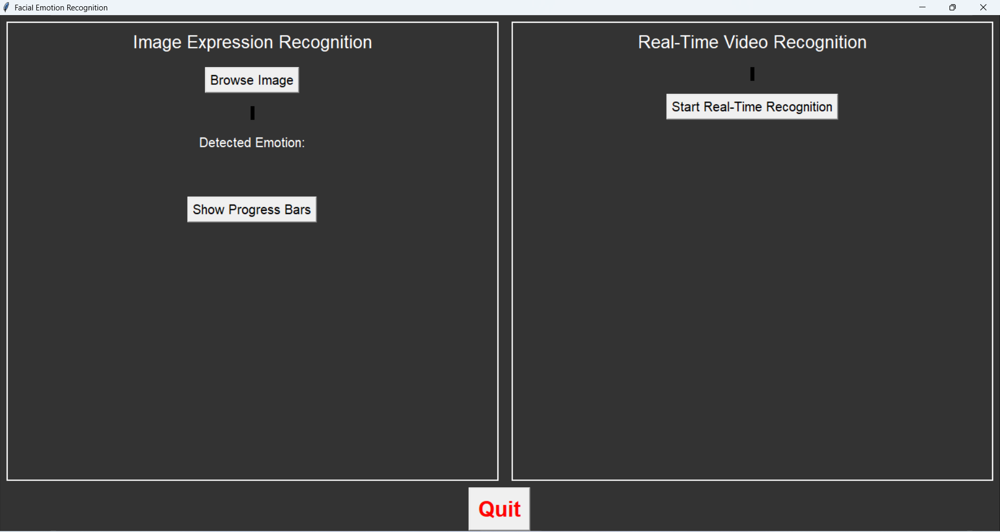
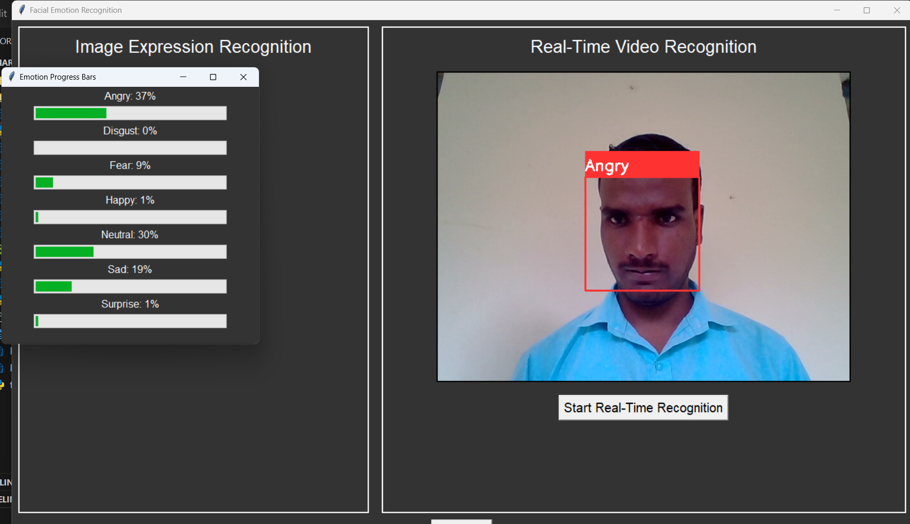
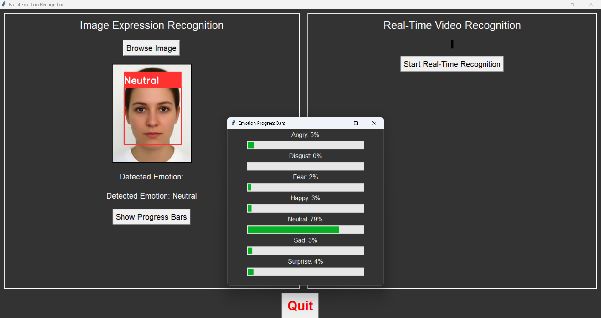

# 🎯 Real-Time Facial Emotion Recognition

This is a Python-based real-time facial emotion recognition system that detects and classifies human emotions from live webcam input or uploaded images.

---

## 📌 Features

- 📷 Real-time face detection using OpenCV
- 🤖 Emotion classification using a deep learning model
- 📊 Displays emotion percentage with progress bars
- 🧠 Trained with FER2013 dataset
- 💻 Simple and user-friendly GUI using Tkinter
- 📁 Image input option for emotion detection

---
## 🖼️ Demo Screenshot






## 🛠️ Tech Stack

- Python
- OpenCV
- TensorFlow / Keras
- Tkinter
- NumPy

---

## 🚀 How I Built It

1. **Preprocessing**: Resized and normalized facial images.
2. **Model Training**: Used CNN (Convolutional Neural Network) with FER2013.
3. **GUI Development**: Created interface using Tkinter with buttons and frames.
4. **Integration**: Real-time webcam + image upload with prediction.
5. **Output Display**: Shows emotion percentage.

---

## ▶️ How to Run

```bash
git clone https://github.com/Kumara5KN/python-project
cd python-project
pip install -r requirements.txt
python app.py
